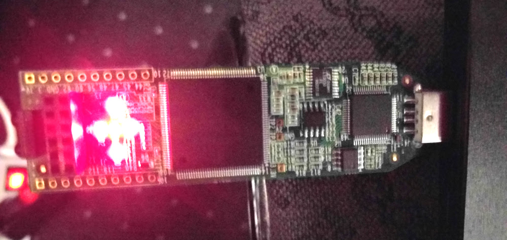
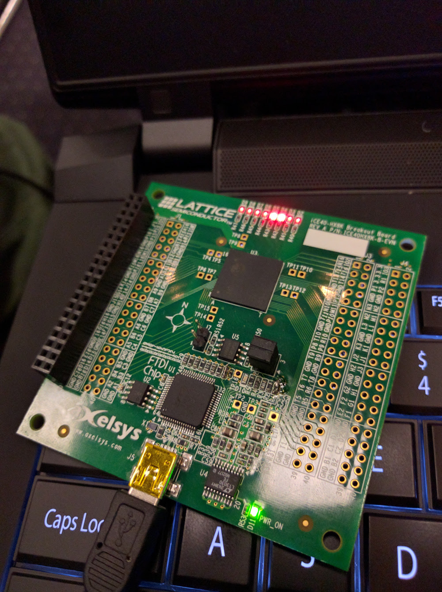

# TEAM-VERILOG

Resources and examples for working with the awesome [Project IceStorm](http://www.clifford.at/icestorm/).

## Installation

To install follow the directions on Clifford's website: http://www.clifford.at/icestorm/

Or you copypasta the following auto-magical line (heads-up, this will make a folder `~/OpenSource_ICE40_Flow`, if you want to use/create a different folder, feel free to clone the directory and alter the install script):

`curl https://raw.githubusercontent.com/gskielian/TEAM-VERILOG/master/ice-ubuntu-14.04-installer.sh | sh`

## examples:

There are two examples we looked at:

* the icestick
* the hx8kboard


current tree:
```sh
.
├── hx8kboard_examples
│   └── example_1_blink
│       ├── example.v
│       ├── hx8kboard.pcf
│       └── Makefile
├── icestick_examples
│   └── example_1_blink
│       ├── example.v
│       ├── icestick.pcf
│       └── Makefile
```


## icestick

<p align="center"></p>

navigate to the directory below:

`./icestick_examples/example_1_blink/`


run with the following line:

```shell
make && sudo make prog
```

make edits to example.v as desired

## hx8kboard

<p align="center"></p>

navigate to the directory below:

`./hx8kboard_examples/example_1_blink/`

run with the following line:

```shell
sudo iceprog -S example.bin
```

